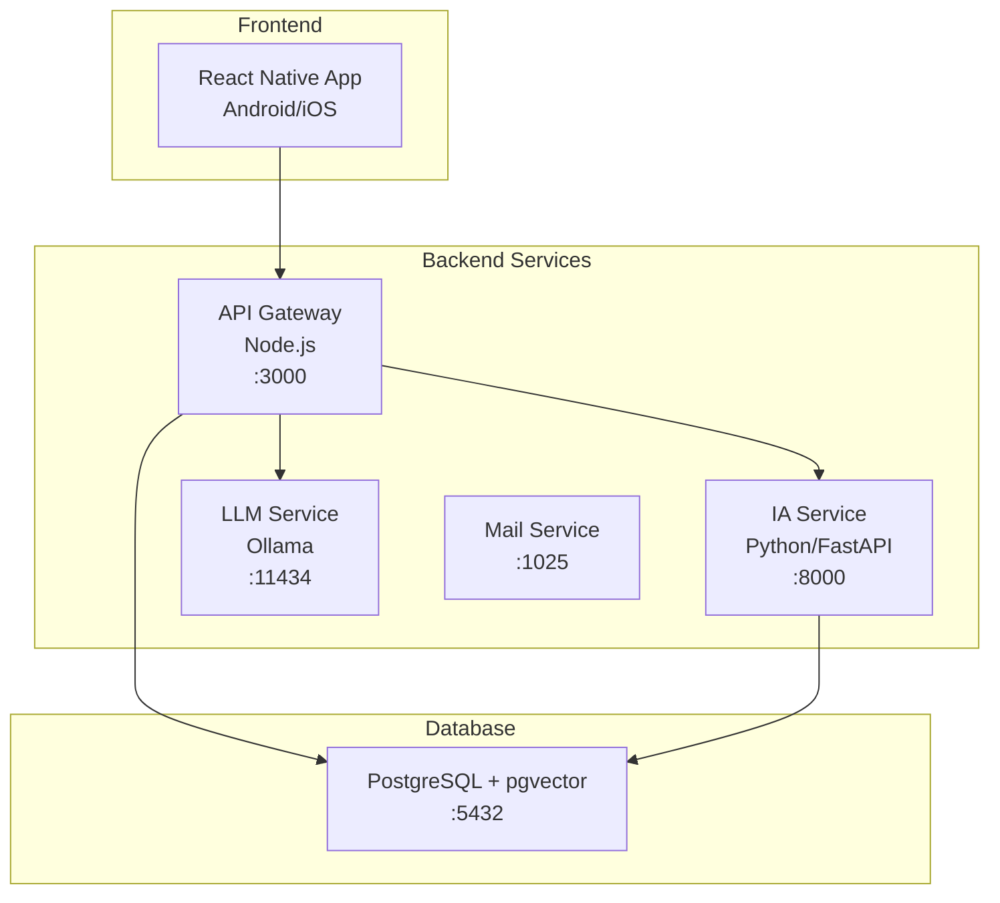

# Arquitetura do Sistema - NaturaDetec

## Visão Geral

O NaturaDetec é uma aplicação mobile para identificação de espécies baseada em microserviços containerizados. O sistema combina **desenvolvimento mobile** (Android/iOS), **inteligência artificial** (reconhecimento de imagem, recomendações) e **processamento de linguagem natural** (chat bot).



## Estrutura e Separação de Responsabilidades

### Frontend Mobile (app/)
**Tecnologia:** React Native + Expo  
**Responsabilidade:** Interface utilizador, captura de fotos, gestão de estado local

**Organização:**
- `src/screens/` - Telas de autenticação e funcionalidades principais
- `src/components/` - Componentes reutilizáveis (botões, listas, etc.)
- `src/contexts/` - Gestão de estado global (Auth, Photos, Recommendations)
- `src/utils/` - Cliente HTTP e utilitários

### API Gateway (api/)
**Tecnologia:** Node.js + Express + PostgreSQL  
**Responsabilidade:** Orquestração, autenticação, proxy para serviços

**Funcionalidades:**
- Autenticação JWT e gestão de utilizadores
- Upload e gestão de ficheiros de imagem
- Proxy para IA Service e APIs externas
- CRUD de favoritos e histórico

### IA Service (ia_service/)
**Tecnologia:** Python + FastAPI + PyTorch + pgvector  
**Responsabilidade:** Processamento de IA e machine learning

**Sistemas de IA Implementados:**

1. **Reconhecimento Facial**
   - Modelo CNN treinado em PyTorch
   - Classificação de imagens com confidence scores
   - Mapeamento taxonómico automático

2. **Sistema de Recomendações**
   - Algoritmos híbridos: KNN + Content-Based + Collaborative
   - Análise de padrões comportamentais
   - Recomendações personalizadas

3. **Reconhecimento de Espécies**
   - Modelo CNN treinado em PyTorch
   - Classificação de imagens com confidence scores
   - Mapeamento taxonómico automático

4. **Vector Search para RAG**
   - Embeddings semânticos com sentence-transformers
   - Base de dados vectorial com pgvector
   - Busca por similaridade para contexto do chat

### LLM Service (llm_service/)
**Tecnologia:** Ollama + OpenRouter  
**Responsabilidade:** Chat bot inteligente com RAG

### Base de Dados
**Tecnologia:** PostgreSQL + extensão pgvector  
**Responsabilidade:** Persistência de dados e vector search

## Como Funciona o Sistema

### Estrutura do Filesystem

```
react-native-PF/
├── docker-compose.yml              # Orquestração dos serviços
├── SYSTEM_ARCHITECTURE.md          # Documentação da arquitetura
│
├── app/                           # FRONTEND - React Native
│   ├── package.json               # Dependências mobile
│   ├── App.tsx                    # Componente raiz
│   ├── config.ts                  # Configurações da app
│   │
│   └── src/
│       ├── assets/                # Imagens, fontes, etc.
│       │   ├── fonts/
│       │   └── images/
│       ├── components/            # Componentes reutilizáveis
│       ├── contexts/              # Gestão de estado (Auth, Photos, etc.)
│       ├── hooks/                 # Hooks personalizados
│       ├── screens/               # Telas da aplicação
│       │   ├── auth/              # Login, Register, ForgotPassword
│       │   └── private/           # Home, Explore, Chat, Recommendations
│       └── utils/                 # HTTP client e utilitários
│
├── api/                           # BACKEND - API Gateway
│   ├── server.js                  # Servidor Express principal
│   ├── package.json               # Dependências Node.js
│   │
│   ├── db/sql.init/               # Scripts de inicialização BD
│   │   ├── 00-create-extensions.sql
│   │   ├── 01-create-users.sql
│   │   ├── 02-create-user_favorites.sql
│   │   ├── 03-user_species_history.sql
│   │   ├── 06-create-documents.sql    # Tabela para RAG
│   │   └── ...
│   │
│   ├── identify_species/          # Imagens de identificação (partilha com IA)
│   └── known_faces/               # Fotos de perfil (partilha com IA)
│
├── ia_service/                    # SERVIÇO DE IA
│   ├── main.py                    # FastAPI server
│   ├── requirements.txt           # Dependências Python
│   │
│   ├── dataset/                   # Modelos e dados de treino
│   │   ├── species_model.pt       # Modelo CNN PyTorch
│   │   ├── species_classes.json   # Mapeamento de classes
│   │   └── train_val/Aves/        # Dados organizados por taxonomia
│   │
│   ├── identify_species/          # Partilha com API
│   └── known_faces/               # Partilha com API
│
├── llm_service/                   # SERVIÇO LLM
│   └── Dockerfile                 # Configuração Ollama
│
└── mail_service/                 # SERVIÇO EMAIL
    └── (Configurado via docker-compose)
```


## Fluxos Principais

### 1. Reconhecimento Facial
**Fluxo:** App → API Gateway → IA Service

1. O utilizador tira ou carrega uma foto para login facial
2. A imagem é enviada para o API Gateway
3. O API Gateway encaminha a imagem para o IA Service
4. O IA Service utiliza a biblioteca face_recognition para comparar a face enviada com as faces registadas
5. Se a face for reconhecida, o sistema retorna o email associado e a confiança da predição
6. A resposta é enviada de volta para a app

### 2. Sistema de Recomendações
**Fluxo:** App → API Gateway → IA Service → PostgreSQL

1. App solicita recomendações personalizadas
2. IA Service analisa histórico do utilizador
3. Algoritmos ML geram sugestões (KNN + Content-Based + Collaborative)
4. Recomendações devolvidas com dados científicos

### 3. Identificação de Espécies
**Fluxo:** App → API Gateway → IA Service

1. Utilizador captura foto na app mobile
2. API Gateway recebe e encaminha para IA Service
3. IA Service processa com modelo CNN PyTorch
4. Resultados enriquecidos com API iNaturalist
5. Dados persistidos e devolvidos à app

### 4. Chat Bot com RAG
**Fluxo:** App → API Gateway → LLM Service + Vector Search (PostgreSQL)

1. Utilizador envia pergunta no chat
2. Sistema faz vector search na base de conhecimento (pgvector)
3. Contexto relevante enviado para LLM (Ollama)
4. Resposta inteligente gerada e devolvida
5. Dados persistidos e devolvidos à app

## Ferramentas de IA Utilizadas

### Core AI Stack
- **PyTorch**: Deep learning framework para CNN de reconhecimento de espécies
- **Scikit-learn**: Algoritmos ML (KNN, OneHotEncoder) para recomendações
- **FastAPI**: API assíncrona para endpoints de IA
- **PostgreSQL + pgvector**: Vector database para embeddings e RAG

### Computer Vision
- **PIL (Pillow)**: Manipulação e processamento de imagens
- **torchvision**: Transformações de imagem para modelos CNN
- **face_recognition**: Reconhecimento facial para autenticação de perfis

### NLP e RAG
- **Ollama**: LLM local (modelo nomic-embed-text para embeddings)
- **OpenRouter**: API externa para modelos LLM avançados
- **pgvector**: Busca vectorial por similaridade para contexto RAG
- **SocketIO**: Comunicação real-time para chat

### APIs Externas
- **iNaturalist API**: Enriquecimento de dados de espécies
- **OpenRouter API**: Acesso a modelos LLM externos

## Deployment e Gestão
- IA Service (porta 8000) para identificação e recomendações
- LLM Service (porta 11434) para chat bot
- Mail Service (porta 1025) para emails
- iNaturalist API externa
- OpenRouter API externa

**Orquestração:** Docker Compose gerencia todos os serviços  
**Rede:** Comunicação interna entre containers  
**Volumes:** Persistência de dados e partilha de ficheiros  
**Ports:** Exposição externa apenas do API Gateway (3000)

### Scripts Básicos
```bash
docker compose up -d        # Iniciar sistema
docker compose logs -f api  # Exemplo para logs ao serviço API
docker compose down         # Parar sistema
```

## Performance e Métricas

**Tempos Típicos:**
- Identificação de espécie: 2-5 segundos
- Recomendações: 1-3 segundos  
- Vector search: 80-200ms

**Otimizações:**
- Índices PostgreSQL otimizados
- Processamento assíncrono de IA
- Cache de resultados
- Modelo CNN quantizado

## Pontos Fortes da Arquitetura

✅**Separação Clara:** Frontend mobile, backend de orquestração, IA especializada  
✅ **Escalabilidade:** Microserviços independentes e containerizados  
✅ **IA Avançada:** CNN, ML híbrido, vector search para RAG  
✅ **Tecnologias Modernas:** React Native, FastAPI, PostgreSQL + pgvector  
✅ **Desenvolvimento:** Ambiente containerizado, fácil setup e debug

---

*Este documento serve como guia técnico para compreensão, manutenção e evolução do sistema NaturaDetec.*
